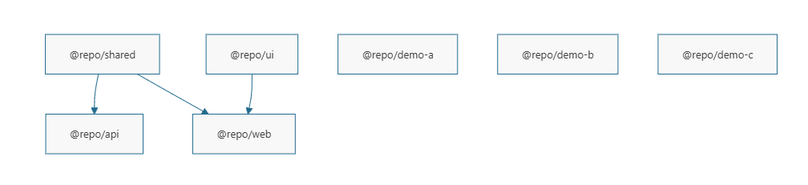

- `pnpm --filter @repo/ui list --depth 0`

这个是指：ui这个包的pacakge.json中的dependencies有哪些。。。

```sh
pnpm --filter @repo/ui list --depth 0
PS D:\yzb\turborepo-learning> pnpm --filter @repo/ui list --depth 0
Legend: production dependency, optional only, dev only

@repo/ui@0.0.0 D:\yzb\turborepo-learning\packages\ui (PRIVATE)
│
│   dependencies:
├── dayjs@1.11.21
├── react@18.3.1
├── react-dom@18.3.1
│
│   devDependencies:
├── @types/react@18.3.29
├── @types/react-dom@18.3.7
└── typescript@5.9.3

6 packages

```

而 `pnpm --filter ...@repo/ui list`:表示是谁使用了ui这个包

```bash
pnpm --filter ...@repo/ui list
PS D:\yzb\turborepo-learning> pnpm --filter ...@repo/ui list
Legend: production dependency, optional only, dev only

@repo/ui@0.0.0 D:\yzb\turborepo-learning\packages\ui (PRIVATE)
│
│   dependencies:
├── dayjs@1.11.21
├── react@18.3.1
├── react-dom@18.3.1
│
│   devDependencies:
├── @types/react@18.3.29
├── @types/react-dom@18.3.7
└── typescript@5.9.3

@repo/web@0.0.0 D:\yzb\turborepo-learning\apps\web (PRIVATE)
│
│   dependencies:
├── @repo/shared@link:../../packages/shared
├── @repo/ui@link:../../packages/ui
├── dayjs@1.11.21
├── react@18.3.1
├── react-dom@18.3.1
├── zod@4.4.3
│
│   devDependencies:
├── @types/react@18.3.29
├── @types/react-dom@18.3.7
├── @vitejs/plugin-react@4.7.0
├── typescript@5.9.3
└── vite@5.4.21

17 packages in 2 projects

```

- 正常情况下，在`...`这样的情况下 我们可以使用 `--depth -1`来直接看结果不看目录树

```bash

pnpm --filter ...@repo/ui list --depth -1
PS D:\yzb\turborepo-learning> pnpm --filter ...@repo/ui list --depth -1
@repo/ui@0.0.0 D:\yzb\turborepo-learning\packages\ui (PRIVATE)

@repo/web@0.0.0 D:\yzb\turborepo-learning\apps\web (PRIVATE)

```

- 这段表示：web包使用了谁，使用了哪些包。。。。

```bash
pnpm --filter @repo/web... list --depth -1
PS D:\yzb\turborepo-learning> pnpm --filter @repo/web... list --depth -1
@repo/web@0.0.0 D:\yzb\turborepo-learning\apps\web (PRIVATE)

@repo/shared@0.0.0 D:\yzb\turborepo-learning\packages\shared (PRIVATE)

@repo/ui@0.0.0 D:\yzb\turborepo-learning\packages\ui (PRIVATE)

```

- `pnpm exec turbo run build --graph` 可以生成DOT格式的`任务依赖图`

```sh
pnpm exec turbo run build  --graph
PS D:\yzb\turborepo-learning> pnpm exec turbo run build  --graph
• turbo 2.9.18

digraph {
        compound = "true"
        newrank = "true"
        subgraph "root" {
                "[root] @repo/api#build" -> "[root] @repo/shared#build"
                "[root] @repo/demo-a#build" -> "[root] ___ROOT___"
                "[root] @repo/demo-b#build" -> "[root] ___ROOT___"
                "[root] @repo/demo-c#build" -> "[root] ___ROOT___"
                "[root] @repo/shared#build" -> "[root] ___ROOT___"
                "[root] @repo/ui#build" -> "[root] ___ROOT___"
                "[root] @repo/web#build" -> "[root] @repo/shared#build"
                "[root] @repo/web#build" -> "[root] @repo/ui#build"
        }
}


```

最终的效果如下:


- `pnpm exec turbo run build --filter @repo/web`表示:
  只构建web包+web包用到的包
