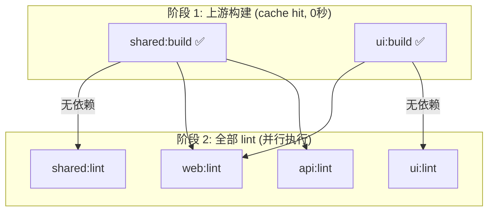

好的，作为老师我给你逐行解读：

---

## 🔍 `pnpm lint` 日志解析

### 📊 先看总览

```
Tasks:    6 successful, 6 total    ← 6 个任务？不是 4 个包吗？
Cached:    2 cached, 6 total       ← 其中 2 个命中缓存
Time:      2.009s
```

**为什么是 6 个任务？** 因为 `dependsOn: ["^build"]` 触发了上游的 `build`！

```
@repo/shared:build  ← lint 的依赖，触发了 build
@repo/ui:build      ← lint 的依赖，触发了 build
@repo/shared:lint   ← 你要的
@repo/ui:lint       ← 你要的
@repo/api:lint      ← 你要的
@repo/web:lint      ← 你要的
```

---

### 📖 逐阶段分析

**阶段 1：上游 build（缓存命中）**

```
@repo/shared:build: cache hit, replaying logs
@repo/ui:build: cache hit, replaying logs
```

> 🎓 `cache hit`！因为你之前 `pnpm build` 过，shared 和 ui 的产物没变，Turbo **一秒都不等**，直接跳过。

**阶段 2：4 个 lint 同时并行**

```
@repo/shared:lint: cache miss → tsc --noEmit
@repo/ui:lint: cache miss → tsc --noEmit
@repo/web:lint: cache miss → tsc --noEmit
@repo/api:lint: cache miss → tsc --noEmit
```

> 🎓 四个是 **`cache miss`**，因为这是第一次跑 lint 任务。等上游 build 就绪后，四个 lint **同时并行**跑，没有一个失败——说明你代码没问题。

---

## 🎯 核心要点



| 你看到的            | 含义                                 |
| ------------------- | ------------------------------------ |
| 6 tasks, 4 packages | lint 本身 4 个 + 上游 build 2 个 = 6 |
| 2 cached            | shared 和 ui 的 build 命中缓存       |
| 4 cache miss        | 4 个 lint 第一次跑，真实执行         |
| 全部并行            | 四个包同时 tsc --noEmit              |
| 2.009s              | 总耗时仅 2 秒                        |

---

## 🎓 第一课总结

你现在彻底理解了：

- **`dependsOn: ["^build"]`** 不仅影响 `build` 任务，任何写了这个的任务（如 `lint`）也会在上游构建完成后才执行
- **缓存粒度是按任务+包**的：`shared:build` 有缓存 ≠ `shared:lint` 有缓存，它们是独立的
- 一个 `pnpm lint` 实际上跑了 **6 个任务**，Turbo 自动编排了依赖

第一课 ✅ 完成。准备好上第二课「改代码看缓存」了吗？
