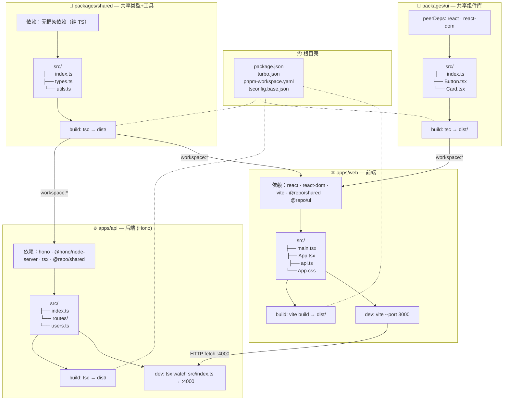
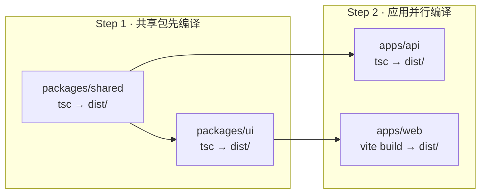
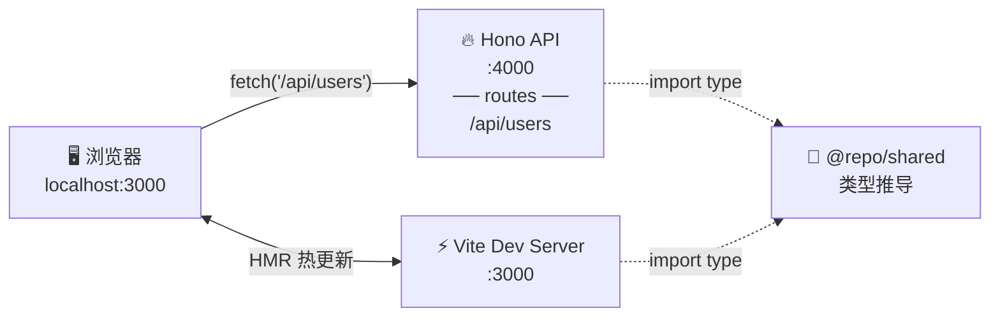

# Turborepo + Hono 完整 Demo 架构

> 日期：2026-06-01
> 技术栈：Turborepo + pnpm + Hono + Vite + React + TypeScript

---

## 目录结构

```
my-monorepo/
├── apps/
│   ├── web/                    # Vite + React 18 前端
│   │   ├── package.json
│   │   ├── tsconfig.json
│   │   ├── vite.config.ts
│   │   ├── index.html
│   │   └── src/
│   │       ├── main.tsx
│   │       ├── App.tsx
│   │       └── api.ts
│   │
│   └── api/                    # Hono 后端
│       ├── package.json
│       ├── tsconfig.json
│       └── src/
│           ├── index.ts
│           └── routes/
│               └── users.ts
│
├── packages/
│   ├── shared/                 # 类型 & 工具 (前后端共用)
│   │   ├── package.json
│   │   ├── tsconfig.json
│   │   └── src/
│   │       ├── index.ts
│   │       ├── types.ts
│   │       └── utils.ts
│   │
│   └── ui/                     # React 组件库 (仅前端)
│       ├── package.json
│       ├── tsconfig.json
│       └── src/
│           ├── index.ts
│           ├── Button.tsx
│           └── Card.tsx
│
├── turbo.json
├── pnpm-workspace.yaml
├── package.json
└── tsconfig.base.json
```

---

## 架构全景图



---

## 构建流水线



---

## 运行时拓扑



---

## 各模块 package.json 关键配置

### packages/shared/package.json

```json
{
  "name": "@repo/shared",
  "version": "0.0.0",
  "private": true,
  "type": "module",
  "main": "./dist/index.js",
  "types": "./dist/index.d.ts",
  "exports": {
    ".": "./dist/index.js"
  },
  "scripts": {
    "build": "tsc",
    "lint": "tsc --noEmit"
  },
  "devDependencies": {
    "typescript": "^5.5.0"
  }
}
```

### packages/ui/package.json

```json
{
  "name": "@repo/ui",
  "version": "0.0.0",
  "private": true,
  "type": "module",
  "main": "./dist/index.js",
  "types": "./dist/index.d.ts",
  "scripts": {
    "build": "tsc",
    "lint": "tsc --noEmit"
  },
  "peerDependencies": {
    "react": "^18.3.0",
    "react-dom": "^18.3.0"
  },
  "devDependencies": {
    "@types/react": "^18.3.0",
    "@types/react-dom": "^18.3.0",
    "typescript": "^5.5.0"
  }
}
```

### apps/web/package.json

```json
{
  "name": "@repo/web",
  "version": "0.0.0",
  "private": true,
  "type": "module",
  "scripts": {
    "dev": "vite --port 3000",
    "build": "tsc && vite build",
    "preview": "vite preview"
  },
  "dependencies": {
    "@repo/shared": "workspace:*",
    "@repo/ui": "workspace:*",
    "react": "^18.3.0",
    "react-dom": "^18.3.0"
  },
  "devDependencies": {
    "@types/react": "^18.3.0",
    "@types/react-dom": "^18.3.0",
    "@vitejs/plugin-react": "^4.3.0",
    "typescript": "^5.5.0",
    "vite": "^5.4.0"
  }
}
```

### apps/api/package.json

```json
{
  "name": "@repo/api",
  "version": "0.0.0",
  "private": true,
  "type": "module",
  "scripts": {
    "dev": "tsx watch src/index.ts",
    "build": "tsc",
    "start": "node dist/index.js"
  },
  "dependencies": {
    "@repo/shared": "workspace:*",
    "hono": "^4.7.0"
  },
  "devDependencies": {
    "@hono/node-server": "^1.13.0",
    "tsx": "^4.19.0",
    "typescript": "^5.5.0",
    "@types/node": "^20"
  }
}
```

---

## 关键代码

### packages/shared/src/types.ts

```typescript
export interface User {
  id: string;
  name: string;
  email: string;
}

export interface ApiResponse<T> {
  success: boolean;
  message: string;
  data: T;
}
```

### packages/shared/src/utils.ts

```typescript
export function generateId(): string {
  return Math.random().toString(36).substring(2, 10);
}
```

### packages/shared/src/index.ts

```typescript
export * from "./types";
export * from "./utils";
```

### packages/ui/src/Button.tsx

```tsx
import React from "react";

interface Props {
  label: string;
  onClick?: () => void;
}

export function Button({ label, onClick }: Props) {
  return <button onClick={onClick}>{label}</button>;
}
```

### packages/ui/src/Card.tsx

```tsx
import React from "react";

interface Props {
  title: string;
  children: React.ReactNode;
}

export function Card({ title, children }: Props) {
  return (
    <div className="card">
      <h3>{title}</h3>
      <div>{children}</div>
    </div>
  );
}
```

### apps/api/src/routes/users.ts

```typescript
import { Hono } from "hono";
import type { ApiResponse, User } from "@repo/shared";
import { generateId } from "@repo/shared";

export const usersRoute = new Hono();

usersRoute.get("/", (c) => {
  return c.json<ApiResponse<User[]>>({
    success: true,
    message: "获取成功",
    data: [
      { id: generateId(), name: "张三", email: "zhangsan@example.com" },
      { id: generateId(), name: "李四", email: "lisi@example.com" },
    ],
  });
});
```

### apps/api/src/index.ts

```typescript
import { Hono } from "hono";
import { cors } from "hono/cors";
import { serve } from "@hono/node-server";
import { usersRoute } from "./routes/users";

const app = new Hono();

app.use("/api/*", cors({ origin: "http://localhost:3000" }));
app.route("/api/users", usersRoute);

app.get("/", (c) => c.text("🏗️ Turborepo API is running!"));

serve({ fetch: app.fetch, port: 4000 }, (info) => {
  console.log(`🚀 API: http://localhost:${info.port}`);
});
```

### apps/web/src/api.ts

```typescript
import type { ApiResponse, User } from "@repo/shared";

const BASE = "http://localhost:4000";

export async function fetchUsers(): Promise<User[]> {
  const res = await fetch(`${BASE}/api/users`);
  const json: ApiResponse<User[]> = await res.json();
  return json.data;
}
```

### apps/web/src/App.tsx

```tsx
import { useEffect, useState } from "react";
import { Button, Card } from "@repo/ui";
import type { User } from "@repo/shared";
import { fetchUsers } from "./api";

export default function App() {
  const [users, setUsers] = useState<User[]>([]);

  const refresh = async () => {
    setUsers(await fetchUsers());
  };

  useEffect(() => { refresh(); }, []);

  return (
    <main>
      <h1>🏗️ Turborepo + Hono Demo</h1>
      <Button label="🔄 刷新" onClick={refresh} />
      {users.map((u) => (
        <Card key={u.id} title={u.name}>
          <p>{u.email}</p>
        </Card>
      ))}
    </main>
  );
}
```

### turbo.json

```json
{
  "$schema": "https://turbo.build/schema.json",
  "tasks": {
    "build": {
      "dependsOn": ["^build"],
      "outputs": ["dist/**"]
    },
    "dev": {
      "cache": false,
      "persistent": true,
      "dependsOn": ["^build"]
    },
    "lint": {}
  }
}
```

---

## 启动命令

```bash
# 根目录，同时跑前端 + 后端
pnpm dev
```

Turbo 会并行启动两个 dev 进程：
- `apps/web` → Vite :3000
- `apps/api` → Hono :4000

---

## 依赖拓扑

```
packages/shared (纯 TS，无框架依赖)
├── packages/ui (依赖 shared，peerDeps: react)
│   └── apps/web (依赖 shared + ui)
└── apps/api (仅依赖 shared)

构建顺序: shared → {ui, api 并行} → web
```
